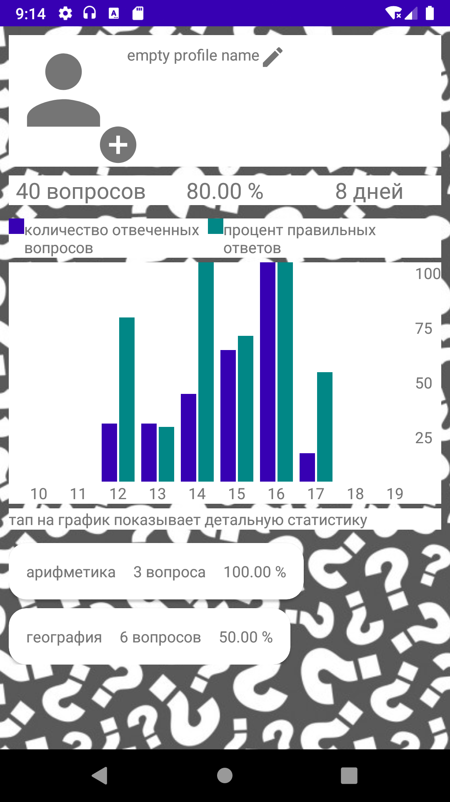
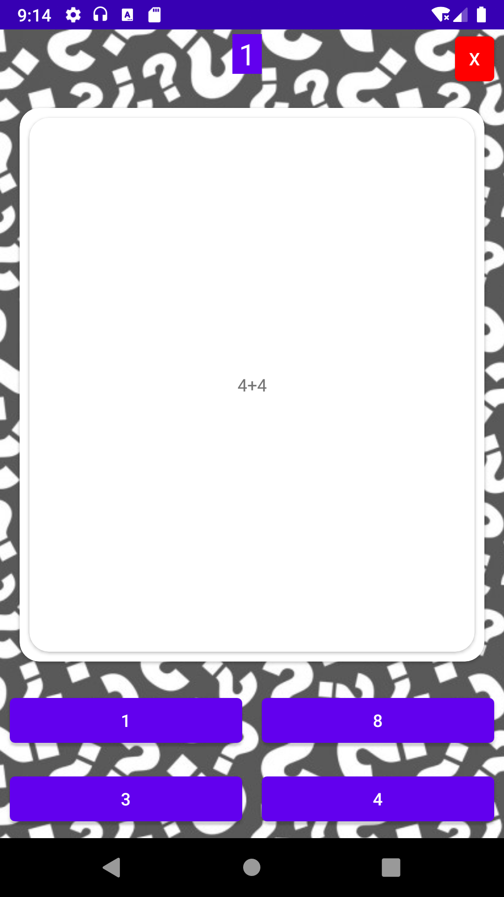

# Quiz

Приложение - вопросы из разных тем

* Вопросы и 4 варианта ответа
* Статистика по результатам ответов

# Используемые технологии:

- Java
- MVVM
- Clean architecture
- RxJava 2
- Dagger 2
- Room

  
  
  

